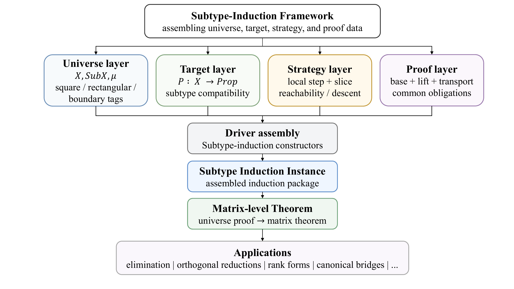

# MatDecompFormal

`MatDecompFormal` is a Lean 4 library for formalizing existence proofs of
matrix decompositions and normal forms. The project turns a recurring textbook
proof pattern - prepare a matrix by a local transformation, reduce to a smaller
subproblem, solve it recursively, and lift the result back - into reusable Lean
interfaces for schemas, transformations, reductions, strategies, matrix
universes, and subtype induction.

The development is described in the paper
[*A Unified Framework for Formalizing Matrix Decomposition Proofs*](https://arxiv.org/abs/2607.05874).



## ✨ Highlights

- **Unified proof architecture.** A common driver assembles universe data,
  target predicates, strategy data, local proof obligations, and lifting or
  transport lemmas into matrix-level decomposition theorems.
- **Cross-type recursion.** The framework handles recursive calls whose slices
  live in different matrix types, such as `Matrix (Fin n) (Fin n) R` reducing to
  `Matrix (Fin (n - 1)) (Fin (n - 1)) R`.
- **General index types.** Square and rectangular matrix universes package
  finite index types, order data, matrices, and measures rather than hard-coding
  only one `Fin n` representation.
- **Reusable algebraic components.** Shared files cover head-tail reindexing,
  block algebra, submatrix and zero-column reductions, triangularity,
  permutation matrices, positive diagonal predicates, and elementary pivoting.
- **Broad instance library.** The current library covers 17 matrix
  decomposition and normal-form families, ranging from PLU and QR to SVD, Smith
  normal form, rational canonical form, and Jordan-type forms.
- **Auditable formal surface.** The paper audit manifest prints axiom
  dependencies for 25 exported theorems representing the counted instance
  families.

This is a formal proof framework, not an executable numerical linear algebra
package. Many constructions are intentionally noncomputable and use classical
choice, matching the theorem-proving setting and the corresponding Mathlib
interfaces.

## 📊 Instance Coverage

The paper's 17-family audit scope reports 37,337 physical lines of Lean code:
34,503 lines in decomposition instances and 2,834 lines in the shared
framework, abstraction, and component layers. The counted Lean sources contain
no `sorry` or `admit`.

| Family | Main route | Target shape |
| --- | --- | --- |
| PLU | Explicit recursive | Unconditional |
| LU | Explicit recursive | Conditional |
| LDL and Cholesky | Explicit recursive / bridge-derived | Conditional |
| QR, Householder QR, Givens QR | Explicit recursive | Unconditional, with structured variants |
| Hessenberg and orthogonal/unitary Hessenberg | Explicit recursive | Unconditional, with structured variants |
| Schur and normal spectral decomposition | Spectral existence | Unconditional / implication-shaped |
| SVD and bidiagonalization | Spectral existence | Unconditional, with structured variants |
| Tridiagonalization | Spectral / explicit variants | Implication-shaped, with structured variants |
| Gauss rank normal form | Explicit recursive | Unconditional |
| UTV | Bridge-derived | Unconditional |
| Smith normal form | Bridge-derived | Unconditional |
| Rational canonical form | Bridge-derived | Unconditional |
| Jordan-type forms | Bridge-derived | Conditional and unconditional variants |

`MatDecompFormal/Instances/ModuleStructure` is included in the repository as a
related algebraic development, but it is not one of the 17 counted matrix
decomposition and normal-form families in the paper statistics.

## 🗂️ Repository Layout

```text
MatDecompFormal/
  Abstractions/      Decomposition schemas, transformations, reductions, strategies
  Framework/         Matrix universes, induction principles, driver assembly
  Components/        Reusable block, lifting, reindexing, property, and reduction lemmas
  Instances/         Concrete decomposition and normal-form developments
Audit/               Exported-theorem axiom audit
MatDecompFormal.lean Main aggregate import
```

Key entry points:

- [`MatDecompFormal.lean`](MatDecompFormal.lean) imports the full library.
- [`MatDecompFormal/Instances.lean`](MatDecompFormal/Instances.lean) imports
  the exposed instance layer.
- [`MatDecompFormal/Framework/Induction.lean`](MatDecompFormal/Framework/Induction.lean)
  provides the reduction-based and subtype-driven induction theorems used to
  recurse across matrix universes whose slice types may differ from the
  original matrix type.
- [`MatDecompFormal/Framework/DecompositionDriver.lean`](MatDecompFormal/Framework/DecompositionDriver.lean)
  contains the square and rectangular driver constructors used by many
  instances.
- [`MatDecompFormal/Framework/UniverseDecomposition.lean`](MatDecompFormal/Framework/UniverseDecomposition.lean)
  exposes `prove_for_matrix`, the final step from a universe-level induction
  instance to a concrete matrix theorem.

## 🚀 Getting Started

Install Lean using `elan`, then build with the pinned toolchain and Mathlib
dependency versions:

```bash
git clone https://github.com/wl-ma/MatDecompFormal.git
cd MatDecompFormal
lake exe cache get
lake build
```

The project is pinned to the Lean toolchain in [`lean-toolchain`](lean-toolchain)
and the dependencies in [`lake-manifest.json`](lake-manifest.json).

Use the full public entry point in another Lean file:

```lean
import MatDecompFormal
```

Or import only the exposed decomposition instances:

```lean
import MatDecompFormal.Instances
```

Example theorem names exposed through the instance layer include:

```lean
#check MatDecompFormal.Instances.exists_plu_decomposition
#check MatDecompFormal.Instances.exists_qr_decomposition
#check MatDecompFormal.Instances.exists_svd
#check MatDecompFormal.Instances.exists_smith_normal_form
```

## 🔎 Axiom Audit

[`Audit/MatDecompPaperAxiomAudit.lean`](Audit/MatDecompPaperAxiomAudit.lean)
contains the exported-theorem manifest used for the paper's axiom-dependency
claim. Run it from the repository root:

```bash
lake env lean Audit/MatDecompPaperAxiomAudit.lean
```

Lean prints the axioms used by each theorem in the manifest. For the audited
paper surface, the expected dependencies are limited to the standard axioms:

```text
Classical.choice
propext
Quot.sound
```

An entry reported as depending on no axioms is also acceptable. If the exported
theorem surface changes, update the manifest and rerun the command before making
repository-wide axiom claims.

## 📄 Paper

- arXiv: <https://arxiv.org/abs/2607.05874>

If you use this repository or the accompanying paper, please cite:

```bibtex
@misc{ma2026matdecompformal,
  title = {A Unified Framework for Formalizing Matrix Decomposition Proofs},
  author = {Ma, Wanli and Wang, Zichen and Wen, Zaiwen},
  year = {2026},
  eprint = {2607.05874},
  archivePrefix = {arXiv},
  url = {https://arxiv.org/abs/2607.05874}
}
```

## 👥 Contributors

- Wanli Ma, Beijing International Center for Mathematical Research, Peking
  University, China ([wlma@pku.edu.cn](mailto:wlma@pku.edu.cn))
- Zichen Wang, School of Mathematical Sciences, Peking University, China
  ([zichenwang25@stu.pku.edu.cn](mailto:zichenwang25@stu.pku.edu.cn))
- Zaiwen Wen, Beijing International Center for Mathematical Research, Peking
  University, China ([wenzw@pku.edu.cn](mailto:wenzw@pku.edu.cn))

## ⚖️ License

Released under the Apache 2.0 license. See [`LICENSE`](LICENSE) for details.
